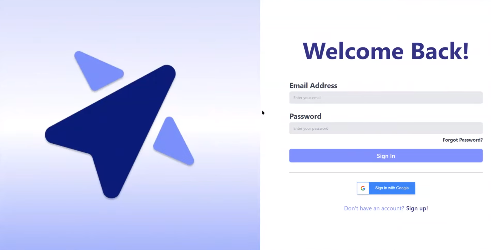
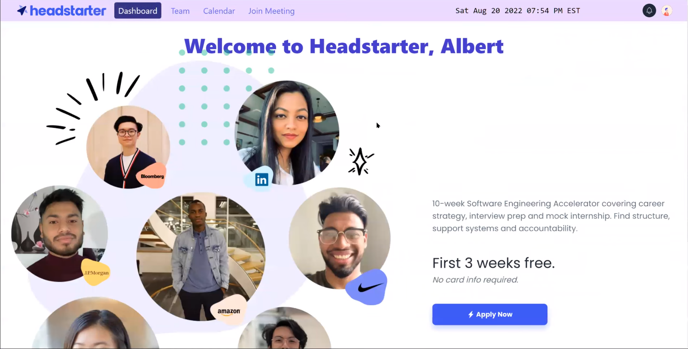
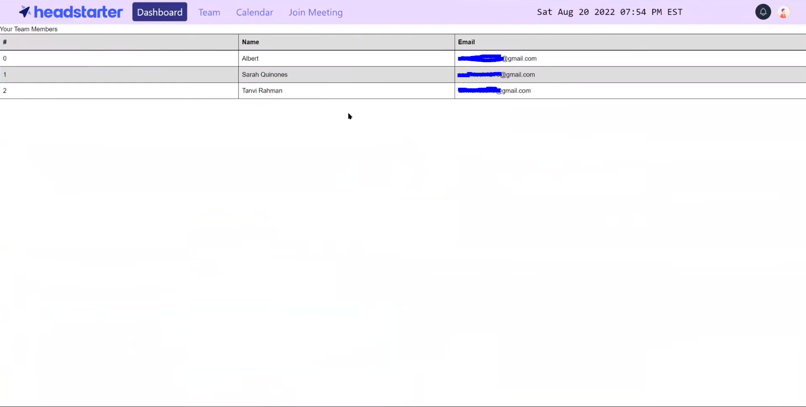
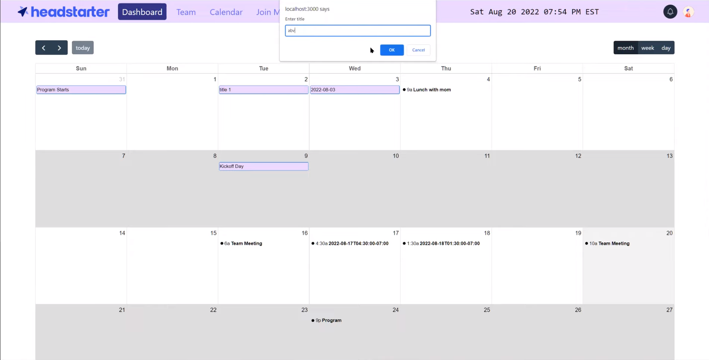
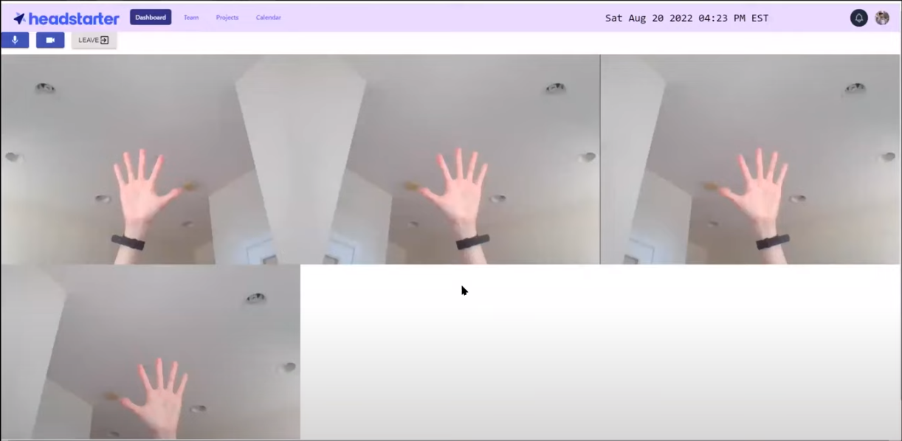
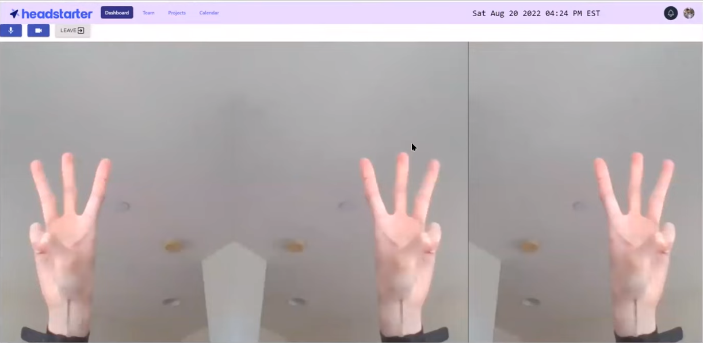

# Video Meeting Manager

A web application that allows teams to schedule and have online video meetings.

## Demo

###  Sign In

###  Home Page

###  Team Member Information

* All the data is retrieved from Firebase *

### Calendar

### Video Meeting (4 Participants)

### Video Meeting (3 Participants)

--- 

[Video Demo](https://youtu.be/IysremtBMNo)

## Tech Stack

* Fronend: React, TailwindCSS
* Backend: Firebase
